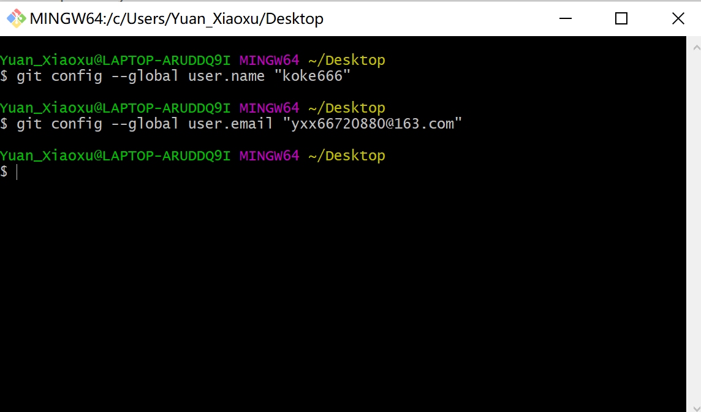
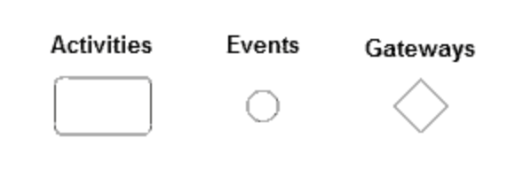

# 一、Github

GitHub是分布式版本控制系统，不需要中央服务器，版本库存储在本地，和集中式版本控制系统相比，具有更高的安全性。

##安装Git

1.  注册GitHub账号；安装git；


2.  打开git bash，配置git

git config --global user.name "koke666"

git config --global user.email "yxx66720880@163.com"




3.  生成密钥,连接本地仓库和远程仓库

ssh -keygen -t rsa -c "yxx66720880@163.com"


4. 创建仓库初始化

mkdir investigation

cd investigation/

git init

5. 基本操作语句

touch readme      //获取文件

git add readme    //添加到缓存区

git commit -m '第一次项目说明'   //添加到仓库

git status  //获取状态

6. 分支管理 

git branch (branchname) //创建分支

git merge //合并分支

7.解决冲突

当不同分支合并时出现冲突，需要手动解决冲突后再提交。


# 二、个人开发环境

## 配置python环境


## 配置JAVA环境


# 三、运维相关概念

## 单点登录

[参考链接][https://developer.aliyun.com/article/636281]

单点登录，英文为Single Sign On (SSO)，即在多个应用系统中，只需要登录一次，就可以访问其他相互信任的应用系统。

解决的问题：运营人员在操作不同的系统时，需要使用不同的账户多次登录，而使用单点登录可以方便运营人员登录不同的系统。

单点登录能保障各业务系统的用户资源的安全 ，各个业务系统获得的信息是这个用户能不能访问我的资源。

### 普通的登录认证机制

填完用户名和密码成功登录后，服务器的在session中标记登录状态为yes，并在浏览器中写入cookie。下次再访问时，请求中会带上这个Cookie，服务端会根据这个Cookie找到对应的session，通过session来判断这个用户是否登录。


### 同域下单点登录

同一个一级域名a.com下的两个业务系统app1.a.com和app2.a.com，单点登录系统sso.a.com。

目标：只要在sso.a.com登录，app1.a.com和app2.a.com就也登录了。

问题：

- Cookie不能跨域的，Cookie的domain属性是sso.a.com，在给app1.a.com和app2.a.com发送请求是带不上的。
- sso、app1和app2是不同的应用，它们的session存在自己的应用内，是不共享的。

解决方法：

- sso登录以后，可以将Cookie的域设置为顶域，即a.com，这样所有子域的系统都可以访问到顶域的Cookie。（在设置Cookie时，只能设置顶域和自己的域，不能设置其他的域。）
- Session 共享，如Spring-Session。


### 不同域下的单点登录

问题：不同域之间Cookie是不共享的。

CAS (Central Authentication Service，中央认证服务)实现单点登录。

**首次登录流程：**

1. 用户访问app系统，app系统是需要登录的，但用户现在没有登录。
2. 跳转到CAS server，即SSO登录系统（CAS Server）。 SSO系统也没有登录，弹出用户登录页。
3. 用户填写用户名、密码，SSO系统进行认证后，将登录状态写入SSO的session，浏览器（Browser）中写入SSO域下的Cookie。
4. SSO系统登录完成后会生成一个ST（Service Ticket），然后跳转到app系统，同时将ST作为参数传递给app系统。
5. app系统拿到ST后，从后台向SSO发送请求，验证ST是否有效。
6. 验证通过后，app系统将登录状态写入session并设置app域下的Cookie。

**SSO已登录的app系统访问流程：**

1. 用户访问app2系统，app2系统没有登录，跳转到SSO。
2. 由于SSO已经登录了，不需要重新登录认证。
3. SSO生成ST，浏览器跳转到app2系统，并将ST作为参数传递给app2。
4. app2拿到ST，后台访问SSO，验证ST是否有效。
5. 验证成功后，app2将登录状态写入session，并在app2域下写入Cookie。


## 前后端分离

[参考链接1][https://juejin.im/post/6844903655850639368] [参考链接2][https://www.jianshu.com/p/bf3fa3ba2a8f]

前后端分离就是把数据操作和显示分离出来。前端专注做数据显示，通过文字，图片或者图标等方式让数据形象直观的显示出来。后端专注做数据的操作。前端把数据发给后端，有后端对数据进行修改。后端提供接口给前端调用，来触发后端对数据的操作。


前后端分离的开发模式：

1. 产品经历/领导/客户提出需求
2. UI做出设计图
3. 前后端约定接口&数据&参数
4. 前后端并行开发（无强依赖，可前后端并行开发，如果需求变更，只要接口&参数不变，就不用两边都修改代码，开发效率高）
5. 前后端集成
6. 前端页面调整
7. 集成成功
8. 交付


互联网架构：

- Web服务器：一般指像nginx，apache这类的服务器，他们一般只能解析静态资源。
- 应用服务器：一般指像tomcat，jetty，resin这类的服务器可以解析动态资源也可以解析静态资源，但解析静态资源的能力没有web服务器好。

一般都是只有web服务器才能被外网访问，应用服务器只能内网访问。


## 微服务

[参考链接][https://www.zhihu.com/question/65502802]

微服务架构是一种架构模式，它提倡将单一应用程序划分成一组小的服务，服务之间相互协调、互相配合，为用户提供最终价值。每个服务运行在其独立的进程中，服务和服务之间采用轻量级的通信机制相互沟通（通常是基于HTTP的Restful API)。

每个服务都围绕着具体的业务进行构建，并且能够被独立的部署到生产环境、类生产环境等。另外，应尽量避免统一的、集中的服务管理机制，对具体的一个服务而言，应根据业务上下文，选择合适的语言、工具对其进行构。


#四、BPMN和Camunda

##BPMN概念

业务流程模型和标记法（BPMN, Business Process Model and Notation）[译注1]是一套图形化表示法，用于以业务流程模型详细说明各种业务流程。

BPMN将元素分为5个基本类别：
流对象，
数据，
连接对象，
泳道，
附加工件。

**流对象**

流对象是用于定义业务流程行为的主要图形元素。它们是活动（或称任务、节点），事件和网关三种。



事件有两种：开始和结束事件，BPMN的XML表示如下：

```<process id="myprocess-Id" name="myprocess" isExecutable="true">
<startEvent id="start"></startEvent>```

```<endEvent id="end"></endEvent>
</process>```

每个流程都是以process为标记，startEvent和endEvent表示开始结束事件。

活动/ 任务的表示如下，这是一个用户任务，也就是需要用户完成的任务，流程会在此等待用户介入：

<userTask id="userTaskId" activiti:assignee="PPP" activiti:formKey="UUU"> </userTask>

一般用户任务和分配者和表单有关，这里分配者和表单都是activiti的自定义数据方式。

 

**数据**

BPMN数据可以使用4种不同的元素类型表示。它们是数据对象，数据输入，数据输出和数据存储。

上面userTask中分配对象和表单数据都是属于数据对象。


XML定义中：

```<sequenceFlow id="sid" sourceRef="start" targetRef="userTaskId"></sequenceFlow>```

这是将前面的开始事件和用户任务连接起来。

```<sequenceFlow id="sid-2" sourceRef="userTaskId" targetRef="end"></sequenceFlow>```

这是将用户任务和结束事件连接起来。

 

**连接对象**

连接对象将流对象连接在一起或连接到其他信息（如数据），它们控制着活动的顺序和过程的整体流程。连接对象的类型是“顺序流”，“消息流”和“关联”。

**泳道**

泳道用于对主要建模元素进行分组，分别由表示池Pools 和弄堂 Lanes的类别术语。

**附加工件**

附加工件提供有关流程的其他信息。BPMN支持的两个标准工件是Groups和Text Annotation。但是，建模器和建模工具可以自由定义自己的附加工件。

##Camunda

Camunda BPM是一个开源工作流和决策自动化平台。 Camunda BPM附带了用于创建工作流和决策模型，在生产中操作已部署模型并允许用户执行分配给他们的工作流任务的工具。

它提供了符合业务流程模型和符号（BPMN）标准的工作流引擎以及符合决策模型和符号（DMN）标准的决策引擎，它们可以通过REST嵌入Java应用程序和其他语言中。

#四、Docker容器

**容器**

容器虚拟化的是操作系统而不是硬件，容器之间是共享同一套操作系统资源的。虚拟机技术是虚拟出一套硬件后，在其上运行一个完整操作系统。

容器和虚拟机具有相似的资源隔离和分配优势，但功能有所不同，因为容器虚拟化的是操作系统，而不是硬件，因此容器更容易移植，效率也更高。

传统虚拟机技术是虚拟出一套硬件后，在其上运行一个完整操作系统，在该系统上再运行所需应用进程；而容器内的应用进程直接运行于宿主的内核，容器内没有自己的内核，而且也没有进行硬件虚拟。因此容器要比传统虚拟机更为轻便。


**Docker容器**

Docker 使用 Google 公司推出的 Go 语言  进行开发实现，基于 Linux 内核 的cgroup，namespace，以及AUFS类的UnionFS等技术，对进程进行封装隔离，属于操作系统层面的虚拟化技术。 由于隔离的进程独立于宿主和其它的隔离的进程，因此也称其为容器。Docke最初实现是基于 LXC.
Docker 能够自动执行重复性任务，用户可以方便地创建和使用容器，把自己的应用放入容器。容器还可以进行版本管理、复制、分享、修改。

Docker 包括三个基本概念：

镜像（Image）
容器（Container）
仓库（Repository）

**特点**

1. 轻量：
在一台机器上运行的多个 Docker 容器可以共享这台机器的操作系统内核；它们能够迅速启动，只需占用很少的计算和内存资源。镜像是通过文件系统层进行构造的，并共享一些公共文件。这样就能尽量降低磁盘用量，并能更快地下载镜像。


2. 标准：
Docker 容器基于开放式标准，能够在所有主流 Linux 版本、Microsoft Windows 以及包括 VM、裸机服务器和云在内的任何基础设施上运行。


3. 安全：
Docker 赋予应用的隔离性不仅限于彼此隔离，还独立于底层的基础设施。Docker 默认提供最强的隔离，因此应用出现问题，也只是单个容器的问题，而不会波及到整台机器。


